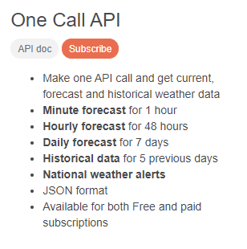

<p align="center">МИНИСТЕРСТВО НАУКИ  И ВЫСШЕГО ОБРАЗОВАНИЯ РОССИЙСКОЙ ФЕДЕРАЦИИ<br>
Федеральное государственное автономное образовательное учреждение высшего образования<br>
"КРЫМСКИЙ ФЕДЕРАЛЬНЫЙ УНИВЕРСИТЕТ им. В. И. ВЕРНАДСКОГО"<br>
ФИЗИКО-ТЕХНИЧЕСКИЙ ИНСТИТУТ<br>
Кафедра компьютерной инженерии и моделирования</p>
<br>
<h3 align="center">Отчёт по лабораторной работе № 1<br> по дисциплине "Программирование"</h3>
<br><br>
<p>студента 1 курса группы ПИ-б-о-201(2)<br>
Попов Андрей Алексеевич<br>
направления подготовки 09.03.04 "Программная инженерия"</p>
<br><br>
<table>
<tr><td>Научный руководитель<br> старший преподаватель кафедры<br> компьютерной инженерии и моделирования</td>
<td>(оценка)</td>
<td>Чабанов В.В.</td>
</tr>
</table>
<br><br>
<p align="center">Симферополь, 2020</p>
<hr>

# Лабораторная работа №1 Погода
**Постановка задачи:** Разработать сервис предоставляющий данные о погоде в городе Симферополе на момент запроса. В качестве источника данных о погоде используется: [http://openweathermap.org/](http://openweathermap.org/). В состав сервиса входит: серверное приложение на языке С++ и клиентское приложение на языке Python.

Серверное приложение (далее Сервер) предназначенное для обслуживания клиентских приложений и минимизации количества запросов к сервису _openweathermap.org_. Сервер должен обеспечивать возможность получения данных в формате JSON и виде _html_ виджета (для вставки виджета на страницу будет использоваться _[iframe](https://habr.com/ru/post/488516/)_).

Клиентское приложение должно иметь графический интерфейс отображающий сведения о погоде и возможность обновления данных по требованию пользователя.

**Цель работы:** 
1.  Закрепить навыки разработки многофайловыx приложений;
2.  Изучить способы работы с API web-сервиса;
3.  Изучить процесс сериализации/десериализации данных в/из json;
4.  Получить базовое представление о сетевом взаимодействии приложений;

## Ход работы

### 1. Получение API Key
Для получения API Key я зарегистрировался на сайте [http://openweathermap.org/](http://openweathermap.org/). После регистрации в разделе API Keys воспользовался пунктом "Create Key" (рис. 1) и сгенерировал бесплатный API-ключ. **Полученный API-ключ**: **0b187d44dbd22fecded8524e7dcd0a8e**


Рис. 1. Скриншот где генерируются ключи

### 2. Составление запроса для подключения погоды
В ходе лабораторной работы, был изучен формат составления запросов к сервису openweathermap.org. Были изучены примеры работы использования API на официальном сайте сервиса: [http://openweathermap.org/appid#use](http://openweathermap.org/appid#use). Наиболее удобным интерфейсом для нас является One Call API (рис. 2), который позволяет одним вызовом получить данные о погоде для указанного места.



Рис. 2. Описание One Call API с сайта openweathermap.org

В структуре ответа сервера содержится информация о почасовом прогнозе на 48 часов (рис. 3).

Необходимыми query параметрами для составления запроса являются: lang=ru - язык (По условию нам необходим русский), lat - широта (Для Симферополя - 44.952116),lon - долгота (Для Симферополя - 34.102411), appid - API ключ.


Рис. 3. Ответ openweathermap на запрос

Таким образом я составил http-запрос: http://api.openweathermap.org/data/2.5/onecall?lat=44.9&lon=34.1&exclude=daily&lang=ru&units=metric&appid=0b187d44dbd22fecded8524e7dcd0a8e

### 3. Составление запроса для получения времени
Для того чтобы получить необходимое время в Симферополе, воспользуемся сервисом [http://worldtimeapi.org/pages/schema](http://worldtimeapi.org/pages/schema). Сервис является бесплатным и не требует регистрации. Изучив примеры использования API с официального сайта, я получил запрос (рис. 4): http://worldtimeapi.org/api/timezone/Europe/Simferopol


Рис. 4. Ответ worldtimeapi на запрос

### 4. Серверное приложение
Для запуска сервера, был использован язык C++, а также сторонние библиотеки: httplib (для работы с HTTP-клиентом и HTTP-сервером), JSON for Modern C++ (позволяет работать с JSON-файлами). Если приходит запрос на "/", сервер формирует и отправляет html-виджет, если же запрос приходит на "/raw", сервер формирует и отправляет json-файл с данными о текущей температуре и состоянии погоды.

Код серверного приложения :
```c++

#include <iostream>
#include <string>
#include <nlohmann/json.hpp>
#include <cpp_httplib/httplib.h>
#include <locale>
using json = nlohmann::json;
using namespace std;
using namespace httplib;

json weather;

void re_wet()
{
	Client cli_wet("api.openweathermap.org");
	auto wet = cli_wet.Get("/data/2.5/onecall?lat=44.9&lon=34.1&exclude=daily&lang=ru&units=metric&appid=0b187d44dbd22fecded8524e7dcd0a8e");
	weather = json::parse(wet->body);
	ofstream wet_cache("cache.json");
	wet_cache << weather;
	wet_cache.close();
}
string swap(string word, string word_1, string word_2)
{
	std::locale::global(std::locale(""));
	size_t pos;
	while ((pos = word.find(word_1)) != std::string::npos)
	{
		word.erase(pos, word_1.size());
		word.insert(pos, word_2);
	}
	return word;
}
int find_nice_time(int current_time)
{
	int nice_time = -1;
	for (int i = 0; i < weather["hourly"].size(); i++) {

		if (current_time < weather["hourly"][i]["dt"])
		{
			nice_time = i;
			break;
		}
		nice_time = -1;
	}
	return nice_time;
}
void raw_response(const Request& req, Response& res) {
	Client time_cli("http://worldtimeapi.org");
	auto time = time_cli.Get("/api/timezone/europe/simferopol");
	json j = json::parse(time->body);
	int current_time = j["unixtime"];
	ifstream wet_caсhe("cache.json");
	string wet_str = "";
	getline(wet_caсhe, wet_str, '\0');
	weather = json::parse(wet_str);
	wet_caсhe.close();
	int nice_time = find_nice_time(current_time);
	if (nice_time == -1)
	{
		re_wet();
		nice_time = find_nice_time(current_time);
	}
	string distr = weather["hourly"][nice_time]["weather"][0]["description"];
	string temp = to_string(int(weather["hourly"][nice_time]["temp"]));
	string str = "{\"pogoda\":\""+distr+"\",\"temp\":"+temp+"}";
	res.set_content(str, "text/json");
}

void gen_response(const Request& req, Response& res) {
	Client time_cli("http://worldtimeapi.org");
	auto time = time_cli.Get("/api/timezone/europe/simferopol");
	json j = json::parse(time->body);
	int current_time = j["unixtime"];
	if (time) {
		if (time->status == 200) {

		}
		else {
			std::cout << "Status code: " << time->status << std::endl;
			string str = "Status code : " + to_string(time->status);
			res.set_content(str, "text/plain");
		}
	}
	else {
		auto err = time.error();
		std::cout << "Error of time code: " << err << std::endl;
		string str = "Error of time code: " + to_string(err);
		res.set_content(str, "text/plain");
	}
	ifstream wet_caсhe("cache.json");
	string wet_str = "";
	getline(wet_caсhe,wet_str, '\0');
	weather = json::parse(wet_str);
	wet_caсhe.close();
	int nice_time = find_nice_time(current_time);
	if (nice_time == -1)
	{
		re_wet();
		nice_time = find_nice_time(current_time);
	}
	ifstream file;
	file.open(R"(include/Погода сейчас.html)");
	if (!file.is_open())
	{
		cout << "Ошибка открытия шаблона" << endl;
		res.set_content("Ошибка открытия шаблона", "text/plain");
	}
	else {
		
		string str = "", str_p = "";
		while (!file.eof())
		{
			str_p = "";
			getline(file, str_p);
			str += str_p;
		}
		file.close();
		
		string distr = weather["hourly"][nice_time]["weather"][0]["description"];
		string temp = to_string(int(weather["hourly"][nice_time]["temp"]));
		string icon = weather["hourly"][nice_time]["weather"][0]["icon"];
		icon += u8"\.png";
			str = swap(str, "{hourly[i].weather[0].description}", distr);
			str = swap(str, "{hourly[i].weather[0].icon}", icon);
		
		str = swap(str, "{hourly[i].temp}", temp);

		res.set_content(str, "text/html");
	}
}

int main() {

	Server svr;
	svr.Get("/", gen_response);
	svr.Get("/raw", raw_response);
	std::cout << "start\n";
	svr.listen("localhost", 3000); 
}
```

### 5. Клиентское приложение
Для создания клиентского приложения использовался язык Python. Использовал библиотеки requests
и json. Приложение подключается к серверу и получает от него данные о текущей температуре и состоянии погоды для города Симферополь

Код клиентского приложения :
```Python
from tkinter import *
import requests
from requests.exceptions import InvalidSchema

def new_wet(event):
	try:
		weather = requests.get('http://localhost:3000/raw', headers={'Content-type': 'text/json; charset=UTF-8'}).json()
	except InvalidSchema:
		print('Can\'t connect to server. Exit')
		exit()
	temp = str(weather['temp']).split('.')[0]
	pogoda["text"]=weather['pogoda']
	temperature["text"]=(temp + '°C')
	print("New weather printed \n")
	pass

try:
	weather = requests.get('http://localhost:3000/raw', headers={'Content-type': 'text/json; charset=UTF-8'}).json()
except InvalidSchema:
	print('Can\'t connect to server. Exit')
	exit()
root = Tk()

temp = str(weather['temp']).split('.')[0]
top = Frame(root, background="#ff4f00")
top.pack(side=TOP, fill=X)
middle = Frame(root, background="white")
middle.pack(side=TOP, fill=BOTH)
bottom = Frame(root, background="#ff4f00")
bottom.pack(side=BOTTOM, fill=X)
Label(top, 
	text="Симферополь", 
	bg="#ff4f00", 
	fg="#333333",
	font=('sans-serif', 10, 'bold')).pack(fill=X)
pogoda=Label(top, 
	text=weather['pogoda'], 
	bg="#ff4f00", 
	fg="#333333",
	font=('sans-serif', 8))
temperature=Label(middle, 
	text=(temp + '°C'), 
	padx=50, 
	pady=50,
	fg="#333333",
	font=('sans-serif', 50, 'bold'))
Label(bottom, bg="#ff4f00").pack(fill=X)
pogoda.pack(fill=X)
temperature.pack(fill=X)
root.bind("<Button-3>",new_wet)

root.mainloop()

```

### 6. Графический интерфейс
Для создания графического интерфейса приложения (рис. 5) использовалась библиотека tkinter.


Рис. 5. Как выглядит клиентское приложение 

### 7. Виджет
При подключении к "/" на сервере, программа автоматически изменяет локальный файл "widget.html" и редактирует соответствующие поля с данными о погоде, затем возвращает браузеру виджет в виде html-документа (рис. 6).


Рис. 6. Виджет

## Вывод

Получил навыки создания многофайловых приложений, создания графического интерфейса с помощью tkinter. Изучил процесс парсинга значений с помощью json-библиотеки. Исследовал методы работы с API-сервисами worldtimeapi и openweathermap. Изучил работу со строками в языке C++, получил базовое представление о сетевом взаимодействии приложений.
