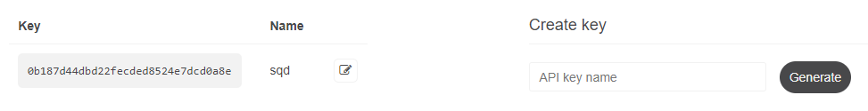
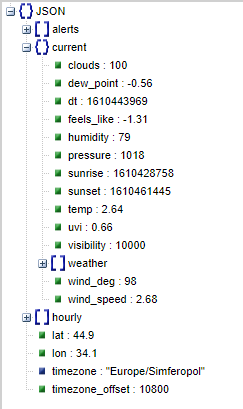
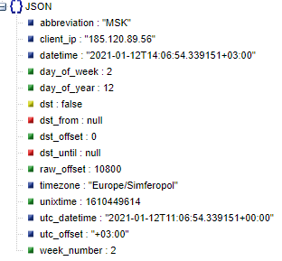
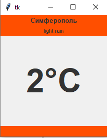
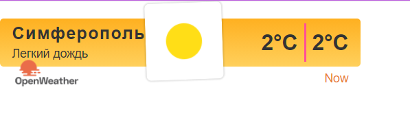

МИНИСТЕРСТВО НАУКИ  И ВЫСШЕГО ОБРАЗОВАНИЯ РОССИЙСКОЙ ФЕДЕРАЦИИ 
Федеральное государственное автономное образовательное учреждение высшего образования 
"КРЫМСКИЙ ФЕДЕРАЛЬНЫЙ УНИВЕРСИТЕТ им. В. И. ВЕРНАДСКОГО" 
ФИЗИКО-ТЕХНИЧЕСКИЙ ИНСТИТУТ 
Кафедра компьютерной инженерии и моделирования

 
<h3 align="center">Отчёт по лабораторной работе № 1  по дисциплине "Программирование"</h3>
  

студента 1 курса группы ПИ-б-о-201(2) 
Попов Андрей Алексеевич 
направления подготовки 09.03.04 "Программная инженерия"

  
<table>
<tr><td>Научный руководитель  старший преподаватель кафедры  компьютерной инженерии и моделирования</td>
<td>(оценка)</td>
<td>Чабанов В.В.</td>
</tr>
</table>
  

Симферополь, 2020

# Лабораторная работа №1 Погода
**Постановка задачи:** Разработать сервис предоставляющий данные о погоде в городе Симферополе на момент запроса. В качестве источника данных о погоде используется: [http://openweathermap.org/](http://openweathermap.org/). В состав сервиса входит: серверное приложение на языке С++ и клиентское приложение на языке Python.

Серверное приложение (далее Сервер) предназначенное для обслуживания клиентских приложений и минимизации количества запросов к сервису _openweathermap.org_. Сервер должен обеспечивать возможность получения данных в формате JSON и виде _html_ виджета (для вставки виджета на страницу будет использоваться _[iframe](https://habr.com/ru/post/488516/)_).

Клиентское приложение должно иметь графический интерфейс отображающий сведения о погоде и возможность обновления данных по требованию пользователя.

**Цель работы:** 
1.  Закрепить навыки разработки многофайловыx приложений;
2.  Изучить способы работы с API web-сервиса;
3.  Изучить процесс сериализации/десериализации данных в/из json;
4.  Получить базовое представление о сетевом взаимодействии приложений;

## Ход работы

### 1. Получение API Key
Для получения API Key я зарегистрировался на сайте [http://openweathermap.org/](http://openweathermap.org/). После регистрации в разделе API Keys воспользовался пунктом "Create Key" (рис. 1) и сгенерировал бесплатный API-ключ. **Полученный API-ключ**: **0b187d44dbd22fecded8524e7dcd0a8e**

Рис. 1. Скриншот где генерируются ключи

### 2. Составление запроса для подключения погоды
В ходе лабораторной работы, был изучен формат составления запросов к сервису openweathermap.org. Были изучены примеры работы использования API на официальном сайте сервиса: [http://openweathermap.org/appid#use](http://openweathermap.org/appid#use). Наиболее удобным интерфейсом для нас является One Call API (рис. 2), который позволяет одним вызовом получить данные о погоде для указанного места.

Рис. 2. Описание One Call API с сайта openweathermap.org

В структуре ответа сервера содержится информация о почасовом прогнозе на 48 часов (рис. 3).

Необходимыми query параметрами для составления запроса являются: lang=ru - язык (По условию нам необходим русский), lat - широта (Для Симферополя - 44.952116),lon - долгота (Для Симферополя - 34.102411), appid - API ключ.

Рис. 3. Ответ openweathermap на запрос

Таким образом я составил http-запрос: http://api.openweathermap.org/data/2.5/onecall?lat=44.9&lon=34.1&exclude=daily&lang=ru&units=metric&appid=0b187d44dbd22fecded8524e7dcd0a8e

### 3. Составление запроса для получения времени
Для того чтобы получить необходимое время в Симферополе, воспользуемся сервисом [http://worldtimeapi.org/pages/schema](http://worldtimeapi.org/pages/schema). Сервис является бесплатным и не требует регистрации. Изучив примеры использования API с официального сайта, я получил запрос (рис. 4): http://worldtimeapi.org/api/timezone/Europe/Simferopol

Рис. 4. Ответ worldtimeapi на запрос

### 4. Серверное приложение
Для запуска сервера, был использован язык C++, а также сторонние библиотеки: httplib (для работы с HTTP-клиентом и HTTP-сервером), JSON for Modern C++ (позволяет работать с JSON-файлами). Если приходит запрос на "/", сервер формирует и отправляет html-виджет, если же запрос приходит на "/raw", сервер формирует и отправляет json-файл с данными о текущей температуре и состоянии погоды.

Ссылка: https://github.com/sqders/Programming/tree/master/Lab/01/ConsoleApplication1

### 5. Клиентское приложение
Для создания клиентского приложения использовался язык Python. Использовал библиотеки requests
и json. Приложение подключается к серверу и получает от него данные о текущей температуре и состоянии погоды для города Симферополь

Ссылка: https://github.com/sqders/Programming/tree/master/Lab/01/Python

### 6. Графический интерфейс
Для создания графического интерфейса приложения (рис. 5) использовалась библиотека tkinter.

Рис. 5. Как выглядит клиентское приложение 

### 7. Виджет
При подключении к "/" на сервере, программа автоматически изменяет локальный файл "widget.html" и редактирует соответствующие поля с данными о погоде, затем возвращает браузеру виджет в виде html-документа (рис. 6).

Рис. 6. Виджет

## Вывод

Получил навыки создания многофайловых приложений, создания графического интерфейса с помощью tkinter. Изучил процесс парсинга значений с помощью json-библиотеки. Исследовал методы работы с API-сервисами worldtimeapi и openweathermap. Изучил работу со строками в языке C++, получил базовое представление о сетевом взаимодействии приложений.