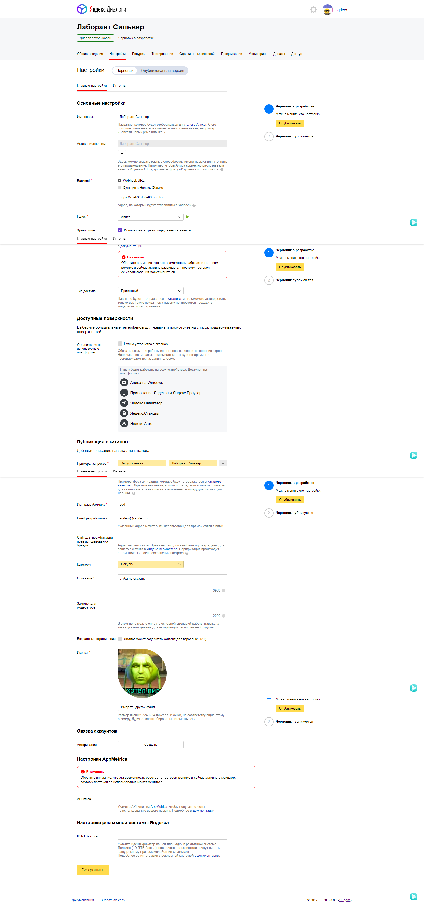

<p align="center">МИНИСТЕРСТВО НАУКИ  И ВЫСШЕГО ОБРАЗОВАНИЯ РОССИЙСКОЙ ФЕДЕРАЦИИ<br>
Федеральное государственное автономное образовательное учреждение высшего образования<br>
"КРЫМСКИЙ ФЕДЕРАЛЬНЫЙ УНИВЕРСИТЕТ им. В. И. ВЕРНАДСКОГО"<br>
ФИЗИКО-ТЕХНИЧЕСКИЙ ИНСТИТУТ<br>
Кафедра компьютерной инженерии и моделирования</p>
<br>
<h3 align="center">Отчёт по лабораторной работе № 2<br> по дисциплине "Программирование"</h3>
<br><br>
<p>студента 1 курса группы ПИ-б-о-201(2)<br>
Попов Андрей Алексеевич<br>
направления подготовки 09.03.04 "Программная инженерия"</p>
<br><br>
<table>
<tr><td>Научный руководитель<br> старший преподаватель кафедры<br> компьютерной инженерии и моделирования</td>
<td>(оценка)</td>
<td>Чабанов В.В.</td>
</tr>
</table>
<br><br>
<p align="center">Симферополь, 2020</p>
<hr>

# Лабораторная работа №2 Алиса
**Постановка задачи:**
1.  Разработать и зарегистрировать навык для Алисы на сервисе Яндекс.Диалоги;
2.  В качестве backend-a для навыка реализовать приложение на языке С++ выполняющее следующие функции:
    1.  Составление продуктовой корзины:
        -   Добавление продукта в корзину;
        -   Удаление продукта из корзины;
        -   Очистка корзины;
        -   Вывод списка товаров в корзине;
        -   Подсчёт стоимости товаров в корзине.
    2.  Вывод справочной информации по навыку;
    3.  Регистрацию webhook-ов сторонних сервисов;
    4.  Отправку данных на сторонние сервисы.
3.  В качестве стороннего сервиса реализовать приложение на языке Python выполняющее следующие функции:
    1.  Ожидание данных о покупке;
    2.  Сохранение поступивших данных в excel-документ.

**Цель работы:** 
1.  Получить представления о структуре post-запроса;
2.  Изучить webhooks как метод взаимодействия web-приложений;

## Ход работы

### 1. Настройка
На главной странице нажал кнопку Консоль, после чего попал на страницу dashboard со всеми созданными навыками. Затем нажал кнопку "Создать диалог", а далее "Навык в Алисе" и попал на страницу настройки навыка; Далее заполнил поля формы (рис. 1) в соответствии с документацией и опубликовал настройки диалога.



Рис. 1. Страница настроек навыка

### 2. Корзина
Корзина использует сессионные данные для хранения выбранных пользователем названий и цен товаров. Функция "Очистить корзину" очищает поле "cina" в данных сессии, команда "Добавить в корзину" добавляет в корзину название и его цену, "Удалить из корзины" -  убирает из корзины указанный объект, "Что в корзине" - выводит все товары в формате: Название и цена, "Сумма" - сообщает суммарную стоимость всех товаров пользователю (рис. 2).


Рис. 2. Демонстрация функционала функции "Корзина"

### 3. Помощь
Если пользователь нажал кнопку "помощь", то режим навыка переключается в режим помощи, а затем перечисляются всевозможные навыки и их краткое описание. Для того чтобы отобразить детальную справку по команде, необходимо ввести необходимую команду или нажать на соответствующую ей кнопку (рис. 3).


Рис. 3. Демонстрация функционала функции "Помощь"

### 4. Управление списком WebHook-служб
При подключении к "/webhooks" на сервере, программа автоматически изменяет локальный файл "template.html" и редактирует соответствующие поля с блоками URL-адресов, подставляя в каждый из них информацию из файла "block.html", а затем возвращает браузеру html-документ (рис. 4). При добавлении или удалении соответствующего WebHook-а, браузер посылает POST-запрос на тот же URN серверу. Затем серверное приложение обрабатывает запрос и совершает необходимое действие.


Рис. 4. Страница управления webhook-ами

### 5. Заполнение Excel-файла
Для работы с Excel-документом клиентское приложение использует модуль Openpyxl для Python. Клиент получает с помощью модуля Flask json-строку с сервера C++. Затем происходит запись данных в буфер, также записывается дата отправки запроса. Буфер очищается, когда количество записей достигнет тысячи, а затем записывается в Excel документ.
Ссылка на Excel документ: [./Python/data.xlsx](./Python/data.xlsx)
### 6. Клиентское приложение
Для создания клиентского приложения использовался язык Python, весь исходный код хранится в одном файле. Использовались библиотеки Openpyxl и Flask. Приложение ждет запроса сервера и получает от него данные корзины пользователя. Исходный код приложения:
```py
from flask import Flask,request
import openpyxl
import datetime
app = Flask(__name__)
count=0
ticha=[]
@app.route('/', methods=['POST', 'GET'])
def index():
	if request.method == 'POST':
		user_id=request.json['user_id']
		check=request.json['check']
		for a in range(len(check)):
			ticha.append(check[a])
			ticha[len(ticha)-1]["user_id"]=user_id
			ticha[len(ticha)-1]["datetime"]= datetime.datetime.now()
		lenght=str(len(ticha))
		print(ticha)
		if(len(ticha)!=10):
			obook=openpyxl.open("data.xlsx",read_only=True)
			osheet=obook.active
			print(osheet.max_column)
			rows=osheet.max_row
			cols=osheet.max_column
			obook.close()
			book=openpyxl.Workbook()
			sheet=book.active
			if(cols==3):
				sheet.cell(row=1,column=1).value = 'N'
				sheet.cell(row=1,column=2).value = "User ID"
				sheet.cell(row=1,column=3).value = "Datetime"
				sheet.cell(row=1,column=4).value = "Item"
				sheet.cell(row=1,column=5).value = "Price"
						
			start=rows-2
			for i in range (start,len(ticha)):
				sheet.cell(row=i+2,column=1).value = i+1
				sheet.cell(row=i+2,column=2).value = ticha[i]["user_id"]
				sheet.cell(row=i+2,column=3).value = ticha[i]["datetime"]
				sheet.cell(row=i+2,column=4).value = ticha[i]["item"]
				sheet.cell(row=i+2,column=5).value = ticha[i]["price"]
						
			book.save("data.xlsx")
			book.close()
		return "OK"
	if request.method == 'GET':
		return "Это GET запрос"
 
if __name__ == "__main__":
	app.run()
```
### 7. Серверное приложение
Для запуска сервера, был использован язык C++, а также сторонние библиотеки: httplib (для работы с HTTP-клиентом и HTTP-сервером), JSON for Modern C++ (позволяет работать с JSON-файлами). Если приходит запрос на "/webhooks", сервер формирует и отправляет html-страницу со список webhook-ов, если же запрос приходит на "/",он проверяет первую строчку request и если там "{"- тоесть начало JSON,то сервер формирует и отправляет json-файл с ответными данными на Яндекс.Диалоги, а если что-то другое ,то отправляет JSON со всеми webhook-ми. Исходный код приложения:

**C++.cpp**
```c++
#include <iostream>
#include <string>
#include <cpp_httplib/httplib.h>
#include <nlohmann/json.hpp>
#include <locale>
#include <fstream>
#include <sstream>
using namespace httplib;
using json = nlohmann::json;
using namespace std;

json j;

string swap(string word, string word_1, string word_2);

void gen_response(const Request& req, Response& res);

void Foo_webhooks(const Request& req, Response& res);


int main() {
    ofstream logger("log.txt", ofstream::app);
    Server svr;
    logger << u8"\nserver started\n";
    svr.Post("/", gen_response);
    svr.Post("/webhooks", Foo_webhooks);
    svr.Get("/webhooks", Foo_webhooks);
    svr.listen("localhost", 1234);
}
string swap(string word, string word_1, string word_2)
{
    std::locale::global(std::locale(""));
    size_t pos;
    while ((pos = word.find(word_1)) != std::string::npos)
    {
        word.erase(pos, word_1.size());
        word.insert(pos, word_2);
    }
    return word;
}

void gen_response(const Request& req, Response& res) {
    ofstream logger("log.txt", ofstream::app);
    string str = u8R"()", j_str = req.body.c_str();


    if (j_str[0] != '{') {
        string str_p;
        ifstream wh_i("wh.json");
        while (!wh_i.eof())
        {
            str_p = u8"";
            getline(wh_i, str_p);
            str += str_p;
        }
        j = json::parse(str);

    }
    else {
        json jreq = json::parse(req.body.c_str()), jres;


        json j_users;

        jres["version"] = "1.0";
        jres["response"] = json::object();
        jres["response"].push_back({ "text"," " });
        jres["response"].push_back({ "tts","" });
        jres["response"]["buttons"] = json::array();
        jres["response"]["buttons"].push_back(json::object());
        jres["response"]["buttons"][0].push_back({ "title","" });
        jres["response"]["buttons"][0].push_back({ "payload", json::object() });
        jres["response"]["buttons"][0].push_back({ "hide",false });
        jres["response"].push_back({ "end_session",false });
        jres["response"]["buttons"][0]["title"] = u8"Молчать";
        jres["response"]["buttons"][0]["payload"] = u8"Молчать";
        jres["response"]["buttons"].push_back(json::object());
        jres["response"]["buttons"][1]["title"] = u8"Помощь";
        jres["response"]["buttons"][1]["payload"] = u8"Помощь";


        if (jreq["session"]["new"])
        {
            jres["response"]["text"] = u8"Здравствуйте! Я помогу вам с покупками.";
            j_users["tts"] = 1;
            j_users["sina"] = json::array();
            j_users["mode"] = 0;
            jres["user_state_update"] = j_users;
        }
        else
        {
            j_users = jreq["state"]["user"];
        }
        if (j_users["mode"] == 1)
        {
            if (jreq["request"]["command"] == "" && jreq["request"]["original_utterance"] == "ping" && jreq["requset"]["type"] == "SimpleUtterance")
            {
                jres["response"]["text"] = u8" ";
            }
            else if (jreq["request"]["nlu"]["tokens"][0] == u8"молчать")
            {
                jres["response"]["text"] = u8"Выключает озвучивание текста\nО чём ещё рассказать ?";
            }
            else if (jreq["request"]["nlu"]["tokens"][0] == u8"говорить")
            {
                jres["response"]["text"] = u8"Включает озвучивание текста\nО чём ещё рассказать ?";
            }
            else if (jreq["request"]["nlu"]["tokens"][0] == u8"помощь")
            {
                jres["response"]["text"] = u8"Помощь помогает вам разобраться в командах навыка\nО чём ещё рассказать ?";
            }
            else if (jreq["request"]["payload"] == u8"Выйти из помощи?" || jreq["request"]["command"] == u8"Выйти из помощи?")
            {
                jres["response"]["text"] = u8"Помощь больше не помогает\nО чём ещё рассказать ?";
            }
            else if (jreq["request"]["payload"] == u8"Очистить корзину\nО чём ещё рассказать ?")
            {
                jres["response"]["text"] = u8"Убирает все предметы и цены в корзине.Их больше не вернуть...\nО чём ещё рассказать ?";
            }
            else if (jreq["request"]["nlu"]["tokens"][0] == u8"добавить" && jreq["request"]["nlu"]["tokens"][1] == u8"в" && jreq["request"]["nlu"]["tokens"][2] == u8"корзину")
            {
                jres["response"]["text"] = u8"Добавляет в корзину что-то включая цену этого чего-то.\nО чём ещё рассказать ?";
            }
            else if (jreq["request"]["payload"] == u8"Что в корзине")
            {
                jres["response"]["text"] = u8"Показывает что находится в корзине и их цену\nО чём ещё рассказать ?";
            }
            else if (jreq["request"]["nlu"]["tokens"][0] == u8"удалить" && jreq["request"]["nlu"]["tokens"][1] == u8"из" && jreq["request"]["nlu"]["tokens"][2] == u8"корзины")
            {
                jres["response"]["text"] = u8"Удаляет что-то из корзины.Что-то будет утрачено навсегда...\nО чём ещё рассказать ?";
            }
            else if (jreq["request"]["payload"] == u8"Сумма")
            {
                jres["response"]["text"] = u8"Складывает цены всего что есть в корзине.\nО чём ещё рассказать ?";
            }
            else if (jreq["request"]["payload"] == u8"Выйти из помощи")
            {
                jres["response"]["text"] = u8"Обращайтесь ещё";
                j_users["mode"] = 0;
                jres["user_state_update"] = j_users;
            }
            else if (jreq["request"]["payload"] == u8"Покупка завершена")
            {
                jres["response"]["text"] = u8"Завершает сеанс .До связи\nО чём ещё рассказать ?";
            }
        }
        else {
            logger << j_users.dump(2);
            if (jreq["request"]["command"] == "" && jreq["request"]["original_utterance"] == "ping" && jreq["requset"]["type"] == "SimpleUtterance")
            {

            }
            else if (jreq["request"]["nlu"]["tokens"][0] == u8"молчать")
            {
                jres["response"]["text"] = u8"Молчу, молчу";
                j_users["tts"] = 0;
                jres["user_state_update"] = j_users;
            }
            else if (jreq["request"]["nlu"]["tokens"][0] == u8"говорить")
            {
                jres["response"]["text"] = u8"Хорошо";
                j_users["tts"] = 1;
                jres["user_state_update"] = j_users;
            }
            else if (jreq["request"]["nlu"]["tokens"][0] == u8"помощь")
            {
                j_users["mode"] = 1;
                jres["user_state_update"] = j_users;
                jres["response"]["text"] = u8R"(Молчать-мутить навык
Говорить-анмутить навык
Помощь - помогает
Очистить корзину - очищает корзину
Добавить в корзину - добавляет в корзину предмет с ценой
Что в корзине - показывает содержимое корзины
Сумма - складывает цену всех предметов 
О чем рассказать подробнее?)";
                jres["response"]["buttons"][1]["title"] = u8"Выйти из помощи";
                jres["response"]["buttons"][1]["payload"] = u8"Выйти из помощи";

            }
            else if (jreq["request"]["command"] == u8"очистить корзину")
            {
                j_users["sina"] = json::array();
                jres["response"]["text"] = u8"Корзина пуста";
                jres["user_state_update"] = j_users;
            }
            else if (jreq["request"]["nlu"]["tokens"][0] == u8"добавить" && jreq["request"]["nlu"]["tokens"][1] == u8"в" && jreq["request"]["nlu"]["tokens"][2] == u8"корзину")
            {

                string name = u8"", cost = u8"";
                for (int i = 3; i < jreq["request"]["nlu"]["tokens"].size() - 2; i++)
                {
                    name += jreq["request"]["nlu"]["tokens"][i].get<string>() + u8" ";
                }
                int i = jreq["request"]["nlu"]["tokens"].size();
                cost += jreq["request"]["nlu"]["tokens"][i - 2].get<string>() + u8" ";
                cost += jreq["request"]["nlu"]["tokens"][i - 1].get<string>();
                j_users["sina"].push_back(json::object());
                i = j_users["sina"].size();
                j_users["sina"][i - 1].push_back({ "item",name });
                j_users["sina"][i - 1].push_back({ "price",cost });
                jres["response"]["text"] = u8"OK";
                jres["user_state_update"] = j_users;
            }
            else if (jreq["request"]["command"] == u8"что в корзине")
            {
                if (j_users["sina"].size() == 0)
                {
                    jres["response"]["text"] = u8"Корзина пуста";
                }
                else
                {
                    string what_in_the_black_box = u8"";
                    for (int i = 0; i < j_users["sina"].size() - 1; i++)
                    {
                        what_in_the_black_box += j_users["sina"][i]["item"].get<string>() + j_users["sina"][i]["price"].get<string>() + u8'\n';

                    }
                    int  i = j_users["sina"].size() - 1;
                    what_in_the_black_box += j_users["sina"][i]["item"].get<string>() + j_users["sina"][i]["price"].get<string>();
                    jres["response"]["text"] = u8"В корзине :\n" + what_in_the_black_box;
                }
            }
            else if (jreq["request"]["nlu"]["tokens"][0] == u8"удалить" && jreq["request"]["nlu"]["tokens"][1] == u8"из" && jreq["request"]["nlu"]["tokens"][2] == u8"корзины")
            {
                string name = u8"", items = u8"[";
                jres["response"]["text"] = u8"Такого в корзине нет";
                for (int i = 3; i < jreq["request"]["nlu"]["tokens"].size(); i++)
                {
                    name += jreq["request"]["nlu"]["tokens"][i].get<string>() + u8" ";
                }
                int kek = 0;
                for (int i = 0; i < j_users["sina"].size(); i++)
                {
                    if (name == j_users["sina"][i]["item"].get<string>())
                    {
                        jres["response"]["text"] = u8"Удалил " + name;
                        continue;
                    }
                    if (kek != 0)
                    {
                        items += u8",";
                    }
                    kek++;
                    items += u8"{\"item\":\"" + j_users["sina"][i]["item"].get<string>() + u8"\",\"price\":\"" + j_users["sina"][i]["price"].get<string>() + "\"}";

                    logger << items + "\n";
                }
                items += u8"]";
                j_users["sina"] = json::parse(items);
                jres["user_state_update"] = j_users;
            }
            else if (jreq["request"]["command"] == u8"сумма")
            {
                int sum = 0;
                for (int i = 0; i < j_users["sina"].size(); i++)
                {
                    sum += stoi(j_users["sina"][i]["price"].get<string>());
                }
                jres["response"]["text"] = u8"Сумма в корзине составляет " + to_string(sum) + u8" руйблей";
            }
            else if (jreq["request"]["command"] == u8"покупка завершена")
            {
                jres["response"]["end_session"] = true;
                jres["response"]["text"] = u8"Заходите ещё";
                string post_web, plus = "";
                if (jreq["session"]["user"]["user_id"].get<string>() != "") {
                    post_web = "{\"user_id\":\"" + jreq["session"]["user"]["user_id"].get<string>() + "\",\"check\":";
                }
                else
                {
                    post_web = "\"user_id\":\"anonymous\",\"check\":";
                }
                ofstream users_o("users.json");
                users_o << j_users["sina"];
                users_o.close();
                ifstream users_i("users.json");
                while (!users_i.eof())
                {
                    plus = u8"";
                    getline(users_i, plus);
                    post_web += plus;
                }
                post_web += "}";
                users_i.close();
                Client cli("http://127.0.0.1:5000");
                auto res = cli.Post("/",post_web, "application/json");
                if (res) {
                    if (res->status == 200) {
                        std::cout << res->body << std::endl;
                    }
                    else {
                        std::cout << "Status code: " << res->status << std::endl;
                    }
                }
                else {
                    auto err = res.error();
                    std::cout << "Error code: " << err << std::endl;
                }
            }
            else{
            jres["response"]["text"] = u8"Введите команду корректно или нажмите на кнопку \"Помощь\" чтобы ознакомится с командами.";
            }
        }

        if (j_users["tts"] == 1)
        {
            string tts = jres["response"]["text"].get<string>();
            jres["response"]["tts"] = tts;
        }
        else
        {
            jres["response"]["tts"] = "sil <[500]>";
            jres["response"]["buttons"][0]["title"] = u8"Говорить";
            jres["response"]["buttons"][0]["payload"] = u8"Говорить";
        }
        if (j_users["mode"] == 1)
        {
            jres["response"]["buttons"][0]["title"] = u8"Выйти из помощи";
            jres["response"]["buttons"][0]["payload"] = u8"Выйти из помощи";
            jres["response"]["buttons"][1]["title"] = u8"Выйти из помощи?";
            jres["response"]["buttons"][1]["payload"] = u8"Выйти из помощи?";
            jres["response"]["buttons"].push_back(json::object());
            jres["response"]["buttons"][2]["title"] = u8"Молчать";
            jres["response"]["buttons"][2]["payload"] = u8"Молчать";
            jres["response"]["buttons"].push_back(json::object());
            jres["response"]["buttons"][3]["title"] = u8"Говорить";
            jres["response"]["buttons"][3]["payload"] = u8"Говорить";
            jres["response"]["buttons"].push_back(json::object());
            jres["response"]["buttons"][4]["title"] = u8"Помощь";
            jres["response"]["buttons"][4]["payload"] = u8"Помощь";
            jres["response"]["buttons"].push_back(json::object());
            jres["response"]["buttons"][5]["title"] = u8"Очистить корзину";
            jres["response"]["buttons"][5]["payload"] = u8"Очистить корзину";
            jres["response"]["buttons"].push_back(json::object());
            jres["response"]["buttons"][6]["title"] = u8"Добавить в корзину";
            jres["response"]["buttons"][6]["payload"] = u8"Добавить в корзину";
            jres["response"]["buttons"].push_back(json::object());
            jres["response"]["buttons"][7]["title"] = u8"Что в корзине";
            jres["response"]["buttons"][7]["payload"] = u8"Что в корзине";
            jres["response"]["buttons"].push_back(json::object());
            jres["response"]["buttons"][8]["title"] = u8"Сумма";
            jres["response"]["buttons"][8]["payload"] = u8"Сумма";
            jres["response"]["buttons"].push_back(json::object());
            jres["response"]["buttons"][9]["title"] = u8"Удалить из корзины";
            jres["response"]["buttons"][9]["payload"] = u8"Удалить из корзины";
            jres["response"]["buttons"].push_back(json::object());
            jres["response"]["buttons"][10]["title"] = u8"Покупка завершена";
            jres["response"]["buttons"][10]["payload"] = u8"Покупка завершена";
        }

        logger << "\n2\n" + j_users.dump(4);
        string str_p;
        ofstream dio("dio.json");
        dio << jres;
        dio.close();
        ifstream dii("dio.json");
        while (!dii.eof())
        {
            str_p = u8"";
            getline(dii, str_p);
            str += str_p;
        }
        dii.close();

    }


    res.set_content(str, "text/json; charset=UTF-8");
}

void Foo_webhooks(const Request& req, Response& res) {
    ofstream logger("log.txt", ofstream::app);
    ifstream wh_i;
    wh_i.open("wh.json");
    string str = u8R"()", str_p = "";
    while (!wh_i.eof())
    {
        str_p = "";
        getline(wh_i, str_p);
        str += str_p;
    }
    wh_i.close();

    j = json::parse(str);
    //logger << req.body.c_str();
    std::string webhooks_html = u8"";
    string typ_web = u8R"(<div class="form-row align-items-center">
                    <div class="col">
                      <input type="text" value="Webhook URL" class="form-control mb-2" disabled>
                    </div>
                    
                    <div class="col">
                      <button type="submit" name="del" value="Webhook URL" class="btn btn-danger mb-2">Удалить</button>
                    </div>
                  </div>)";
    string strp;
    ifstream file;
    file.open("include/Webhooks.html");
    while (!file.eof())
    {
        strp = u8"";
        getline(file, strp);
        webhooks_html += strp;
    }
    file.close();
    string stub = u8"{webhooks_list}";
    int pos;
    pos = webhooks_html.find(stub);
    webhooks_html.erase(pos, stub.size());

    if (req.has_param("del")) {
        ofstream wh_o("wh.json");
        auto val = req.get_param_value("del");
        for (int i = 0; i < j["webhooks"].size(); i++)
        {

            if (j["webhooks"][i] == val)
            {
                j["webhooks"].erase(j["webhooks"].begin() + i);
            }

        }
        wh_o << j;
        wh_o.close();
        logger << j;
    }
    if (req.has_param("set")) {
        ofstream wh_o("wh.json");
        auto val = req.get_param_value("set");
        j["webhooks"].push_back(val);
        wh_o << j;
        wh_o.close();
        logger << j;
    }
    if (j["webhooks"] == NULL)
    {
        res.set_content(webhooks_html, "text/html");
    }
    else
    {
        for (int i = 0; i < j["webhooks"].size(); i++)
        {
            string copy_typ_web = typ_web, url = u8R"(Webhook URL)";
            copy_typ_web = swap(copy_typ_web, url, j["webhooks"][i]);
            copy_typ_web = swap(copy_typ_web, url, j["webhooks"][i]);
            webhooks_html.insert(pos, copy_typ_web);
        }
    }


    res.set_content(webhooks_html, "text/html; charset=UTF-8");
}
```
**Вывод:**
Была достигута цель работы ,а именно получунны представления о структуре post-запроса и изучены webhooks как метод взаимодействия web-приложений , также по ходу выполенния лабораторной работы были получены навыки взаимодействия с excel таблицами при помощь языка Python ,были улучшены умения взаимодействия с json форматом ,были изучены возможности и способности Навыков в Яндекс.Диалоге.
