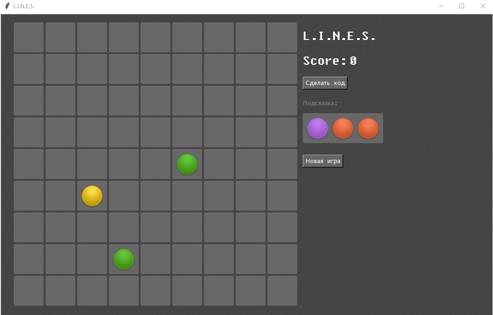

МИНИСТЕРСТВО НАУКИ  И ВЫСШЕГО ОБРАЗОВАНИЯ РОССИЙСКОЙ ФЕДЕРАЦИИ 
Федеральное государственное автономное образовательное учреждение высшего образования 
"КРЫМСКИЙ ФЕДЕРАЛЬНЫЙ УНИВЕРСИТЕТ им. В. И. ВЕРНАДСКОГО" 
ФИЗИКО-ТЕХНИЧЕСКИЙ ИНСТИТУТ 
Кафедра компьютерной инженерии и моделирования

 
<h3 align="center">Отчёт по лабораторной работе № 2  по дисциплине "Программирование"</h3>
  

студента 1 курса группы ПИ-б-о-201(2) 
Попов Андрей Попов 
направления подготовки 09.03.04 "Программная инженерия"

  
<table>
<tr><td>Научный руководитель  старший преподаватель кафедры  компьютерной инженерии и моделирования</td>
<td>(оценка)</td>
<td>Чабанов В.В.</td>
</tr>
</table>
  

Симферополь, 2020

## Постановка задачи

1.  Используя стандартный модуль для разработки программ с графическим интерфейсом Tkinter реализуйте игру Lines на зыке Python.
2.  В качестве образца графического интерфейса используйте [[игру lines]](http://game-shariki.ru/linii-2).

## Цель работы
1.  Закрепить навыки разработки программ с простым графическим интерфейсом пользователя на языке Python при помощи библиотеки Tkinter;
2.  Получить представление о разработке простых игровых приложений.

Каталоги:
[[Игра]](./Python)

## Выполнение работы

1. Для выполнения данной лабораторной работы необходимо было установить библиотеку для разработки графического интерфейса tkinter и библиотеку работы с изображениями pillow.

2. Далее была разработана сама игра. При разработке был использованы элементы объектно-ориентированного программирования.

3. Скриншот в процессе игры:

Рисунок 1. Интерфейс игры

[[Каталог игры]](./Python)

## Вывод
Были достигнуты поставленые цели ,а именно были закрепленны навыки создания простого интерфейса на языке Python при помощи библиотеки Tkinter , были полученны представления о разработке игровых приложений и была реализована игра lines на языке Python.