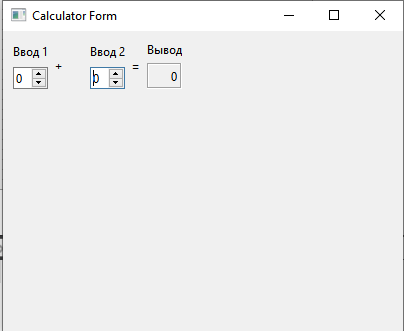

  

МИНИСТЕРСТВО НАУКИ  И ВЫСШЕГО ОБРАЗОВАНИЯ РОССИЙСКОЙ ФЕДЕРАЦИИ 
Федеральное государственное автономное образовательное учреждение высшего образования 
"КРЫМСКИЙ ФЕДЕРАЛЬНЫЙ УНИВЕРСИТЕТ им. В. И. ВЕРНАДСКОГО" 
ФИЗИКО-ТЕХНИЧЕСКИЙ ИНСТИТУТ 
Кафедра компьютерной инженерии и моделирования

 
<h3 align="center">Отчёт по лабораторной работе № 4  по дисциплине "Программирование"</h3>
  

студента 1 курса группы ПИ-б-о-201(2) 
Попов Андрей Алексеевич 
направления подготовки 09.03.04 "Программная инженерия"

  
<table>
<tr><td>Научный руководитель  старший преподаватель кафедры  компьютерной инженерии и моделирования</td>
<td>(оценка)</td>
<td>Чабанов В.В.</td>
</tr>
</table>
  

Симферополь, 2021

# Лабораторная работа №4 Знакомство с фреймворком Qt
**Постановка задачи:**
Настроить рабочее окружение, для разработки программного обеспечения при помощи Qt и IDE Qt Creator, а также изучить базовые возможности данного фреймворка.

**Цель работы:** 
1.  Установить фреймворк Qt;
2.  Изучить основные возможности создания и отладки программ в IDE Qt Creator.

## Ход работы

### Задание 1
 В ходе выполнения лабораторной работы, была загружена последняя версия QT с официального сайта проекта. В процессе установки была выбрана версия `MinGW 8.1.0` и `QT 6.0.1` (рис. 1).
 
 

Рис. 1. Выбор версии QT и MinGW

Также был отредактирован проект-пример "Calculator Form Example": был заменен текст Input 1", "Input 2", "Output" на "Ввод 1", "Ввод 2" и "Вывод" соответственно (рис. 2).

Рис. 2. Отредактированное приложение QT

#### Задание 2
1. Для того, чтобы изменить цветовую схему (оформление среды) необходимо зайди в параметры среды разработки (Главное меню - инструменты - параметры - тема/цвет)
2. Закомментировать/раскомментировать блок кода возможно с помощью сочетаний клавиш `CTRL+/`или с помощью соответствующего пункта контекстного меню `Закомментировать/раскомментировать`
3. Чтобы открыть проводник с помощью средств QT, необходимо в окне "проекты" выбрать необходимый файл проекта и кликнуть ПКМ, затем выбрать пункт `Показать в проводнике`
4. QT использует следующие расширения для файлов-проектов: .pro
5. Чтобы запустить код без отладки необходимо нажать на кнопку `Запустить` или нажать `Ctrl+R`
6. Чтобы начать код с отладкой необходимо нажать на кнопку `Начать отладку запускающего проекта`
7. Чтобы установить/убрать брекпойнт необходимо кликнуть на необходимую строку слева от окна редактора или нажать клавишу `F9`
#### Задание 3
6 строка: d=7.802206e-318, i=0

7 строка: d=7.802206e-318, i=5

8 строка: d=5, i=5

## Вывод
Установил фреймворк Qt, изучил основные возможности создания и отладки программ в IDE Qt Creator.